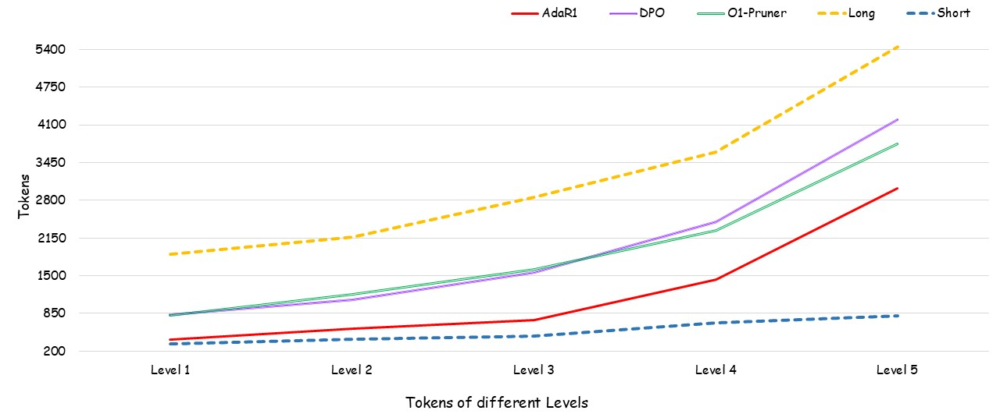

# 🔍 Ada-R1: From Long-CoT to Hybrid-CoT via Bi-Level Adaptive Reasoning Optimization

📢 **Update (Sep 2025):**
Our paper **\[Ada-R1: From Long-CoT to Hybrid-CoT via Bi-Level Adaptive Reasoning Optimization]** has been **accepted at NeurIPS 2025** 🎉.

---

## ✨ Overview

**AdaR1** is a two-stage **adaptive reasoning framework** designed to improve the efficiency of large language models (LLMs) without sacrificing reasoning performance.

While **Long Chain-of-Thought (Long-CoT)** reasoning enhances LLMs on complex tasks, it often leads to **substantial inference overhead** and does not always guarantee higher accuracy.

To address this, AdaR1 introduces a **bi-level adaptive strategy** that dynamically controls reasoning depth by considering both **problem difficulty** and **reasoning redundancy**.

---

## 🚀 Key Contributions

* 🔄 **Hybrid Adaptive Reasoning**: Dynamically switches between **Long-CoT** and **Short-CoT** according to problem difficulty.
* ⚡ **Efficiency**: Reduces average reasoning length by **50%+**, cutting inference cost significantly.
* 🎯 **Accuracy Preservation**: Maintains accuracy across **five challenging mathematical reasoning benchmarks**.
* 🧠 **Bi-Level Optimization**: Introduces adaptive control at both *instance-level* and *token-level*.

---

## 📊 Results

### Results of AdaR1-7B

### Accuracy of Different Methods

### Tokens Used of Different Methods

---

## Reproduce Guide [In Progress]
To reproduce our method, you need to use MergeKit, LLaMA-Factory and our dataset construction scripts.

### Step 0: Prepare a Short-CoT Model

When using models from the **Deepseek-Distilled** series, inconsistencies in chat templates may arise. To address this issue, we fine-tune the **Long-CoT model** using 2,000 short-CoT samples with consistent templates, thereby obtaining the **Short-CoT model**. If the two models you are using share the same chat template, this step can be omitted. The specific parameter settings of LLaMA-Factory can be found at `/LLaMA-Factory-YAMLs/ds-7b-short-sft.yaml` and `/LLaMA-Factory-YAMLs/ds-1b-short-sft.yaml`

### Step 1: Merge Long and Short Models

Subsequently, we employ **MergeKit** to merge the **Long-CoT** and **Short-CoT** models. The configuration can be modified to your own path at ...
And then run: ...

### Step 2: Construct Training Dataset

Then we use the scripts provided by **Light-R1** to generate initial samples from the Short-CoT and Long-CoT models. You should run the following commands: ...

### Step 3: Training an Adaptive Reasoning Model

After completing all the above steps, you can execute the final training phase using **LLaMA-Factory** or any other framework that **supports DPO**. We provide the configuration file for LLaMA-Factory in ...
